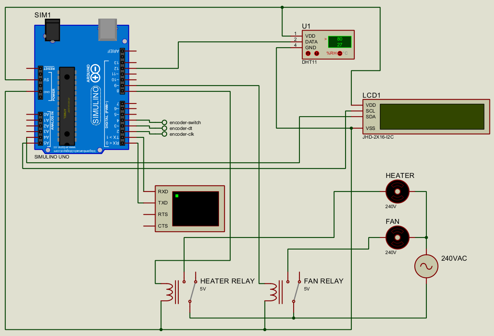

  <h1>Arduino Room Temperature Control</h1>
  
<h3 align="center"> 🚀</h3>

## Components
- Arduino Uno
- dht11 temperature sensor
- 2 channel relay module
- 220V Heater
- 220V Fan
- Rotary Encoder
- LCD with I2C Adapter

# 📝 Documentation

# 📚 References

# 🤝🏻 Connect with Me

# 📜 License

Licensed under the GPL3 License, Copyright 2025 Huzaifa Irfan. [LICENSE](LICENSE)
